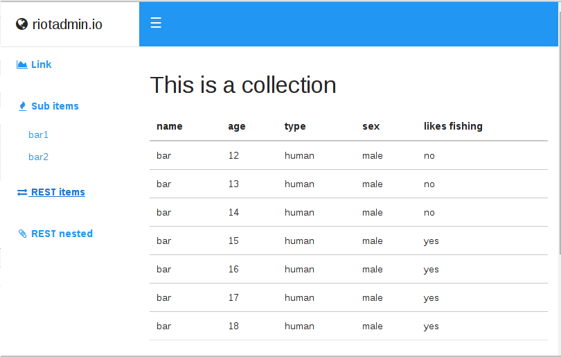

generic api-agnostic admin dashboard interface, like ng-admin but less javascript-ish.

## Usage 

    

    <script type="text/javascript">
      riotadmin({
        "project":{
          "title": "riotadmin.io",
          "logo": "<i class='fa fa-fw fa-globe'/>&nbsp;",
          "url": "http://mylandingpage.com"
        },
        "menu":{
          "items":[

            .....

            { 
              "icon":"<i class='fa fa-fw fa-area-chart'></i>&nbsp;",
              "label": "Link",
              "href":"/foo",
              "target": "_blank",
              "type":"link"
            },

            .....

            },{
              "icon":"<i class='fa fa-fw fa-exchange'></i>&nbsp;",
              "label":"REST items",
              "href":"#/rest-items",
              "type":"collection",
              "data": function(cb,options){
                // replace data with an ajax/rest call (use options object to pass on query,sort,order,limit,offset etc)
                cb({
                  title: "This is a collection",
                  data:[
                    {"name":"bar","age":12,"type":"human","sex":"male","likes fishing":"no"},
                    {"name":"bar","age":13,"type":"human","sex":"male","likes fishing":"no"},
                    {"name":"bar","age":14,"type":"human","sex":"male","likes fishing":"no"},
                    {"name":"bar","age":15,"type":"human","sex":"male","likes fishing":"yes"},
                    {"name":"bar","age":16,"type":"human","sex":"male","likes fishing":"yes"},
                    {"name":"bar","age":17,"type":"human","sex":"male","likes fishing":"yes"},
                    {"name":"bar","age":18,"type":"human","sex":"male","likes fishing":"yes"}
                  ]
                });
              }

           ..... and so on

## Building 

This is optional (for those who want to fiddle with the source), but here goes:

    $ npm install riot-admin 
    // now run test/index.html in your browser

finally this will bundle everything into `dist/riot-admin.js`

    $ npm run-script compile

## Philosophy

* built to re-use
* configure from json 
* extend to own flavor
* no steep javascript learning curve (ng-admin)
* you need to provide data using ajax/rest/websocket etc
